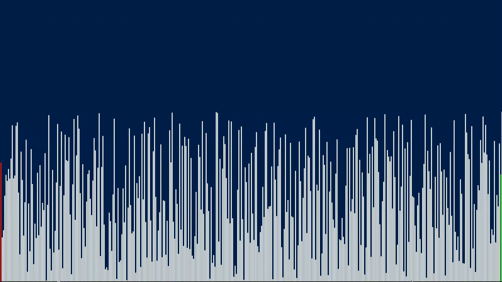

<h1 align='center'>Sorting Algorithm Visualizer V2</h1>

This is my sorting algorithm visualizer.
I've learned to work with classes, headers and project managment.
This project was mainly created for educational purposes but tured out
to be a good project!

For now these sorting algorithms are implemented:

<ul>
    <li>Insertion Sort</li>
    <li>Cocktail Sort (Shaker)</li>
</ul>

<h3>Demo</h3>

 

<h3>TODO:</h3>

- Comparisons counter
- Approx. time of sort
- More sorting algorithms implemented
- Visualization controls (pause/change algorithm/repeat etc.)?!
- ...